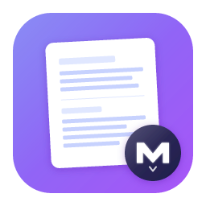

<p align="center">
  
</p>

<h1 align="center">MD</h1>

<p align="center">
  A fast, lightweight Markdown ecosystem: desktop app + browser extension.
</p>

<p align="center">
  
  
  
</p>

## Overview

MD is a markdown viewing ecosystem with two components:

| Component | Purpose |
|-----------|---------|
| **MD App** | Desktop application for local markdown files with full editing, print/PDF export |
| **MD Extension** | Browser extension that renders raw `.md` URLs beautifully |

Both share the same rendering engine, styles, and keyboard shortcuts.

## Screenshots

<p align="center">
  
  &nbsp;&nbsp;
  
</p>

---

## MD App (Desktop)

### Features

- **Live Preview** - Real-time markdown rendering with GitHub-flavored markdown support
- **Mermaid Diagrams** - Native support for flowcharts, sequence diagrams, and more with theme-aware colors
- **Syntax Highlighting** - Code blocks with beautiful syntax highlighting powered by Shiki
- **Edit Mode** - WASM-powered editor with language-aware syntax highlighting for 16+ languages
- **Table of Contents** - Quick navigation panel with Ctrl+G, highlights current section
- **Scroll Sync** - Position preserved when switching between edit and preview modes
- **In-Document Search** - Find text with Ctrl+F, visual minimap for match locations
- **Draft Tabs** - Create untitled drafts with Ctrl+N, auto-numbered for easy access
- **Themes** - Dark and light themes with fully customizable colors
- **File Watching** - Automatic reload when the file changes externally
- **Recent Files** - Quick access to recently opened files with Ctrl+1-9
- **Customizable Fonts** - Choose font family and size for both UI and markdown content
- **Resizable Sidebar** - Drag to resize or double-click to auto-fit content
- **Print/PDF Export** - Export documents with Ctrl+P using optimized print styles

### Keyboard Shortcuts

| Shortcut | Action |
|----------|--------|
| `Ctrl+O` | Open file |
| `Ctrl+N` | New untitled draft |
| `Ctrl+W` | Close file |
| `Ctrl+S` | Save changes (in edit mode) |
| `Ctrl+Z` | Undo (in edit mode) |
| `Ctrl+Y` | Redo (in edit mode) |
| `Ctrl+F` | Find in document |
| `Ctrl+G` | Table of contents |
| `Ctrl+P` | Print / Export PDF |
| `Ctrl+L` | Toggle line numbers (in edit mode) |
| `Ctrl+T` | Toggle theme (dark/light) |
| `Ctrl+B` | Toggle sidebar |
| `Ctrl+H` | Help |
| `Ctrl+,` | Open settings |
| `Ctrl++` | Increase font size |
| `Ctrl+-` | Decrease font size |
| `Ctrl+0` | Reset font size |
| `Ctrl+1-9` | Open Nth file/draft from sidebar |
| `Ctrl+[/]` | Previous/next file |
| `Ctrl+Space` | Toggle edit mode |
| `Tab` | Indent line(s) (in edit mode) |
| `Shift+Tab` | Dedent line(s) (in edit mode) |
| `Esc` | Cancel edit / close search / discard changes |

### Installation

#### Pre-built Binaries

Download the latest release for your platform from the [Releases](https://github.com/dnl-fm/md/releases) page.

- **Linux**: `.deb`, `.rpm`, or `.AppImage`
- **macOS**: `.dmg`
- **Windows**: `.msi` or `.exe`

#### Build from Source

```bash
# Clone the repository
git clone https://github.com/dnl-fm/md.git
cd md

# Install dependencies
bun install

# Development mode
make dev

# Build for production
make build
```

### Configuration

Configuration is stored in:
- **Linux**: `~/.config/com.fightbulc.md-preview/config.json`
- **macOS**: `~/Library/Application Support/com.fightbulc.md-preview/config.json`
- **Windows**: `%APPDATA%\com.fightbulc.md-preview\config.json`

---

## MD Extension (Browser)

### Features

- **Auto-Detection** - Renders raw `.md` URLs from GitHub, GitLab, Gitea, and any plain text markdown
- **Syntax Highlighting** - Code blocks with Shiki
- **Mermaid Diagrams** - Flowcharts, sequence diagrams, etc.
- **Table of Contents** - Navigate long documents with Ctrl+G
- **Theme Support** - Dark/light themes, follows system preference
- **Print/PDF** - Export with Ctrl+P
- **Raw View** - Toggle to see original markdown source
- **Font Size** - Adjustable with Ctrl++/-
- **Full Width** - Toggle between constrained and full-width layout (default: on)
- **Persistent Settings** - Theme, font size, width saved across all sites

### Keyboard Shortcuts

| Shortcut | Action |
|----------|--------|
| `Ctrl+G` | Table of contents |
| `Ctrl+T` | Toggle theme |
| `Ctrl+U` | Toggle raw markdown |
| `Ctrl+P` | Print / PDF |
| `Ctrl++` | Increase font size |
| `Ctrl+-` | Decrease font size |
| `Ctrl+0` | Reset font size |
| `Ctrl+H` | Help |

### Installation

#### Load Unpacked (Development)

```bash
cd packages/extension
bun install
bun run build
```

1. Open `chrome://extensions` (Chrome) or `about:debugging` (Firefox)
2. Enable Developer mode
3. Click "Load unpacked" and select `packages/extension/dist`

#### Supported URLs

- `*.md` files served as `text/plain`
- `raw.githubusercontent.com/*`
- `gist.githubusercontent.com/*`
- GitLab/Gitea raw file URLs
- Any URL ending in `.md` or `.markdown`

> **Note:** Local `file://` URLs are not supported. Syntax highlighting and Mermaid diagrams are loaded from CDN, which is blocked on local files. Use the MD desktop app for local markdown files.

---

## Tech Stack

- **[Tauri 2](https://tauri.app/)** - Native app framework
- **[SolidJS](https://www.solidjs.com/)** - Reactive UI framework
- **[Shiki](https://shiki.matsu.io/)** - Syntax highlighting
- **[markdown-it](https://github.com/markdown-it/markdown-it)** - Markdown parser
- **[Mermaid](https://mermaid.js.org/)** - Diagram rendering
- **[Vite](https://vitejs.dev/)** - Build tool
- **[Bun](https://bun.sh/)** - JavaScript runtime & package manager

## Project Structure

```
md/
├── packages/
│   ├── shared/       # Shared styles (CSS variables, markdown, print)
│   ├── app/          # Tauri desktop app (SolidJS + Rust)
│   └── extension/    # Chrome/Firefox extension
├── docs/             # Screenshots, plans, LLM docs
└── Makefile          # Development commands
```

## License

MIT License - see [LICENSE](LICENSE) for details.

## Contributing

Contributions are welcome! Please feel free to submit a Pull Request.

1. Fork the repository
2. Create your feature branch (`git checkout -b feature/amazing-feature`)
3. Commit your changes (`git commit -m 'Add some amazing feature'`)
4. Push to the branch (`git push origin feature/amazing-feature`)
5. Open a Pull Request
