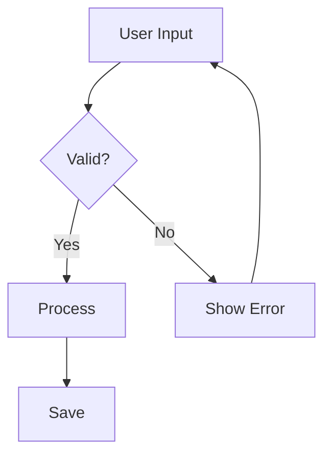

# ASCII Diagrams

ASCII diagrams use the same Mermaid-like syntax but render as box-drawing characters.
Perfect for copy-pasting into terminals, plain text docs, or code comments.

## Flowchart

```ascii
flowchart TD
    A[Start] --> B{Decision?}
    B -->|Yes| C[Action A]
    B -->|No| D[Action B]
    C --> E[End]
    D --> E
```

## Sequence Diagram

```ascii
sequenceDiagram
    Client ->> Server: HTTP Request
    Server ->> Database: Query
    Database -->> Server: Results
    Server -->> Client: JSON Response
```

## Entity Relationship

```ascii
erDiagram
    USER {
        int id
        string name
        string email
    }
    POST {
        int id
        ref user_id
        string title
        text content
    }
    USER ||--o{ POST : writes
```

## State Diagram

```ascii
stateDiagram
    [*] --> Draft
    Draft --> Review: submit
    Review --> Published: approve
    Review --> Draft: reject
    Published --> [*]
```

## Class Diagram

```ascii
classDiagram
    class Animal {
        +string name
        +int age
        +speak()
        +move()
    }
```

## Table

```ascii
table
    title: Feature Comparison
    columns: Feature | Mermaid | ASCII
    ---
    Rich SVG graphics | Yes | No
    Copy-pasteable | No | Yes
    Works in terminal | No | Yes
    Theme colors | Yes | No
    Interactive | Yes | No
```

## Timeline

```ascii
timeline
    title: Release Schedule
    v1.0 : Initial release
    : Core features
    v1.1 : Bug fixes
    : Performance improvements
    v2.0 : Major update
    : New UI
```

## Comparison: Mermaid vs ASCII

Here's the same flowchart in both formats:

### Mermaid (SVG)



### ASCII (Box Drawing)

```ascii
flowchart TD
    A[User Input] --> B{Valid?}
    B -->|Yes| C[Process]
    B -->|No| D[Show Error]
    C --> E[Save]
    D --> A
```

## When to Use ASCII

- Documentation that needs to work in plain text
- Code comments
- Terminal output
- Email / chat where images don't work
- Accessibility (screen readers)
- Version control diffs

## Emoji Conversion

ASCII diagrams automatically convert emoji to text equivalents:

```ascii
table
    columns: Input | Output
    ---
    ✅ | [x]
    ❌ | [ ]
    ⚠ | [!]
    → | ->
```
