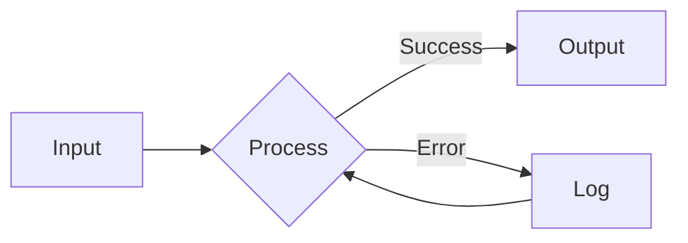
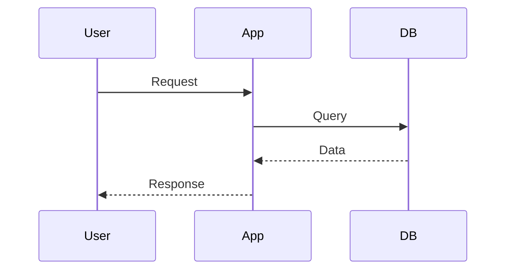
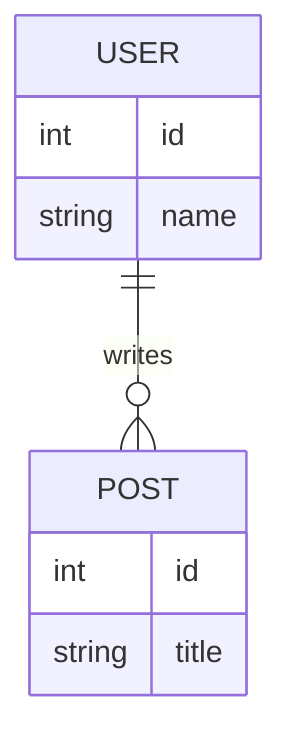

# Kitchen Sink

Everything MD can render in one document.

---

## Text Formatting

Regular text with **bold**, *italic*, ***both***, ~~strikethrough~~, and `inline code`.

> A wise blockquote with **formatting** and `code`.

## Lists

- Unordered item
  - Nested item
- [x] Completed task
- [ ] Pending task

1. Ordered item
2. Second item
   1. Nested ordered

## Links & Images

[GitHub](https://github.com) | [Docs](./README.md) | <https://example.com>


## Table

| Feature | Status | Notes |
|---------|:------:|-------|
| Syntax highlighting | ✅ | 16+ languages |
| Mermaid diagrams | ✅ | SVG rendering |
| ASCII diagrams | ✅ | Box-drawing |
| Tables | ✅ | GFM style |
| Math | ❌ | Not yet |

## Code with Syntax Highlighting

```typescript
interface Config {
  theme: "dark" | "light";
  fontSize: number;
}

const config: Config = {
  theme: "dark",
  fontSize: 14,
};

async function loadConfig(): Promise<Config> {
  const data = await fetch("/api/config");
  return data.json();
}
```

```sql
SELECT u.name, COUNT(p.id) as posts
FROM users u
LEFT JOIN posts p ON u.id = p.user_id
WHERE u.active = TRUE
GROUP BY u.id
ORDER BY posts DESC;
```

```bash
#!/bin/bash
echo "Hello, World!"
for i in {1..5}; do
    echo "Count: $i"
done
```

## Mermaid Diagram







## ASCII Diagram

```ascii
flowchart TD
    A[Start] --> B{Check}
    B -->|OK| C[Done]
    B -->|Fail| D[Retry]
    D --> B
```

```ascii
table
    title: Quick Comparison
    columns: Type | Pros | Cons
    ---
    Mermaid | Beautiful | Can't copy
    ASCII | Copy-paste | Plain text
```

```ascii
sequenceDiagram
    Client ->> Server: GET /api
    Server -->> Client: 200 OK
```

## Nested Content

<details>
<summary>Expandable Section</summary>

### Hidden Content

This section is collapsed by default.

```javascript
console.log("Hidden code!");
```

| Hidden | Table |
|--------|-------|
| A | B |

</details>

## Keyboard Shortcuts

Press <kbd>Ctrl</kbd>+<kbd>G</kbd> for table of contents.

## Final Notes

---

This document demonstrates all major MD features:

1. **Text formatting** - bold, italic, strikethrough, code
2. **Structure** - headings, lists, blockquotes, horizontal rules
3. **Links & media** - URLs, images, references
4. **Tables** - alignment, complex content
5. **Code** - inline, fenced blocks, syntax highlighting
6. **Diagrams** - Mermaid SVG and ASCII box-drawing
7. **HTML** - details/summary, kbd, mark

*Generated for MD testing purposes.*
