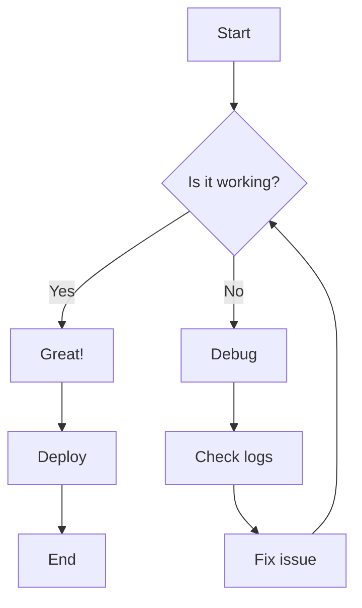
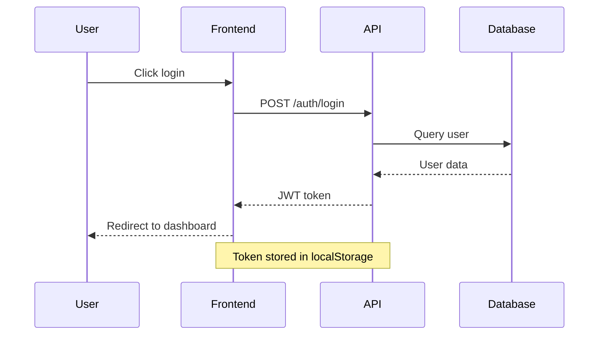
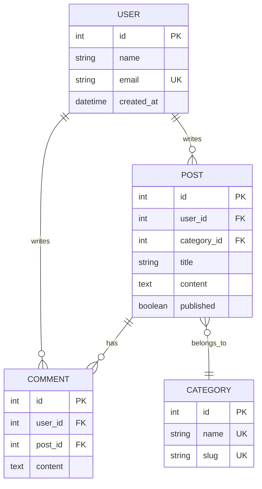
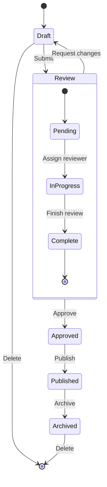
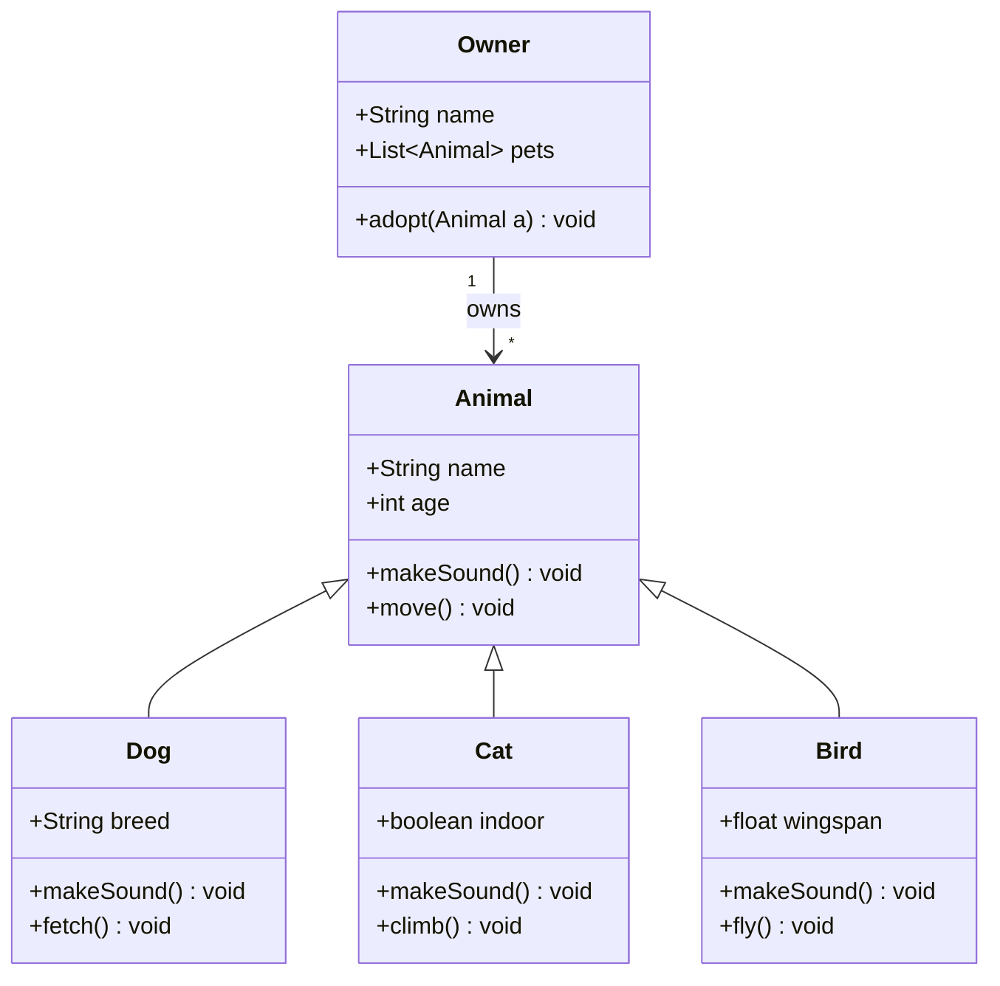
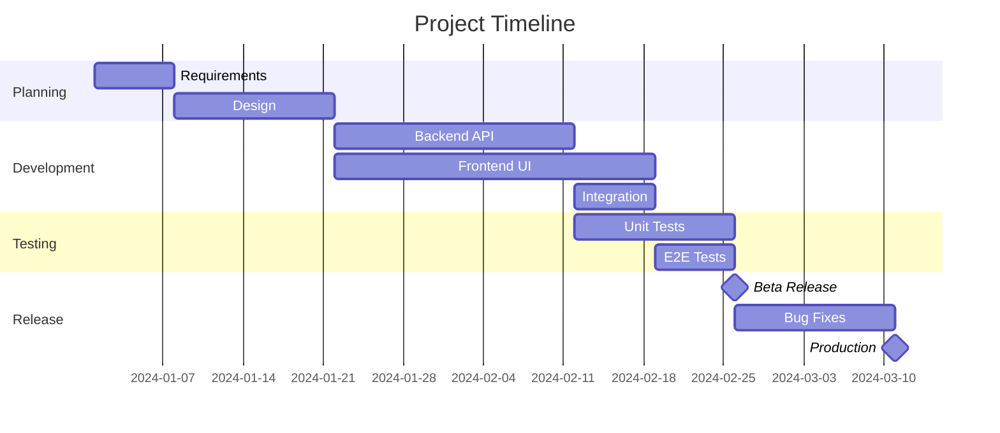
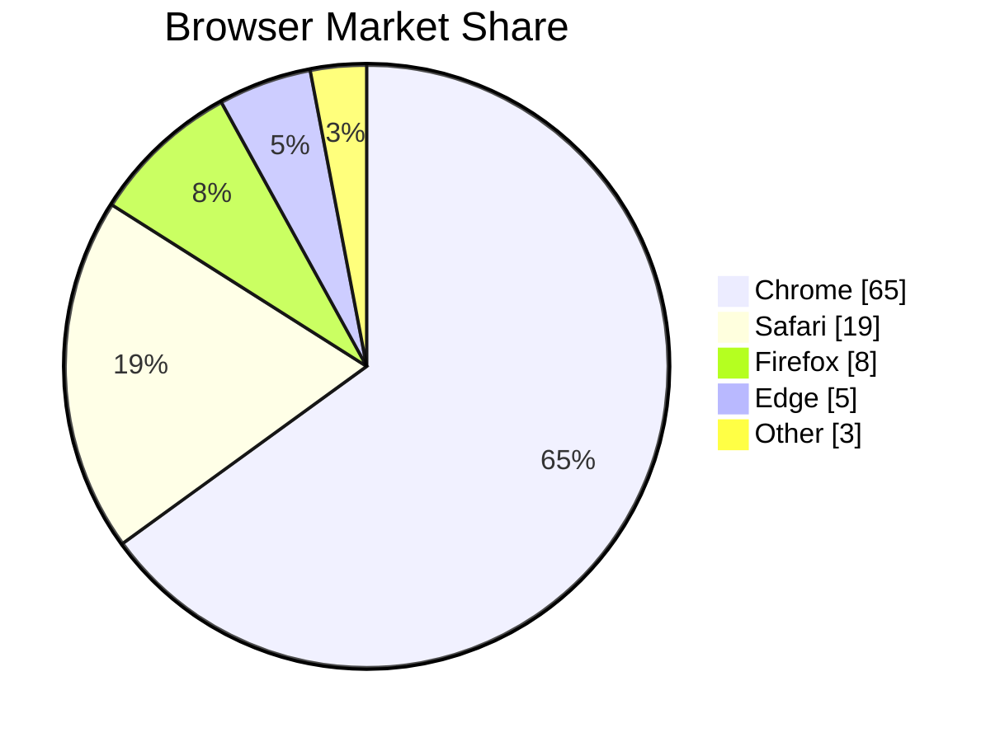
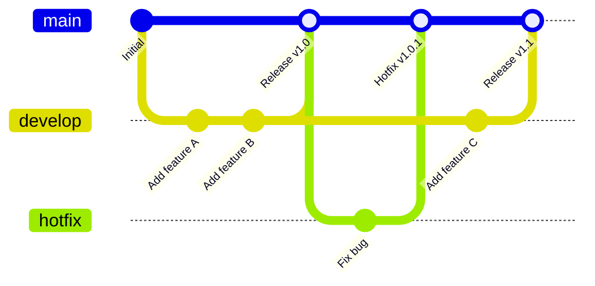
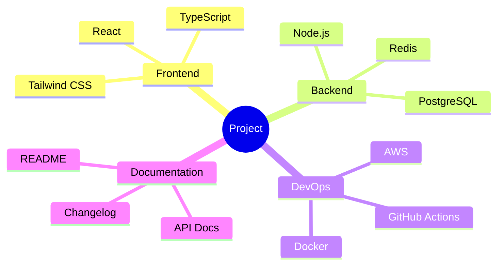

# Mermaid Diagrams

MD renders Mermaid diagrams as interactive SVG graphics with theme-aware colors.

## Flowchart

## Sequence Diagram

## Entity Relationship Diagram

## State Diagram

## Class Diagram

## Gantt Chart

## Pie Chart

## Git Graph

## Mindmap

